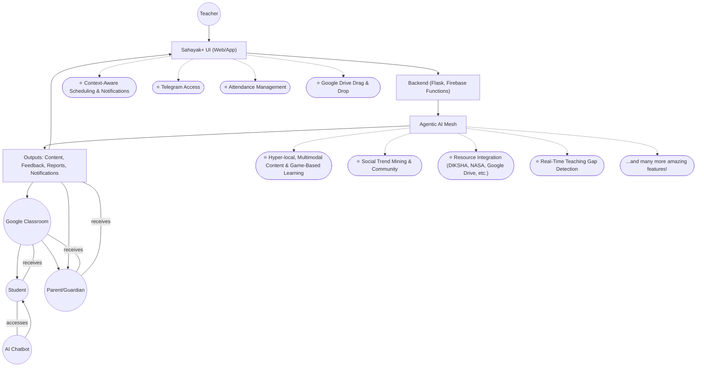

# Sahayak+ — The Agentic AI Teaching Assistant
*Empowering India's Multi-Grade Classrooms with Adaptive, Emotion-Aware AI*

---

## My Motivation as a Student Innovator
Hi! I'm a 3rd year BTech student who's passionate about solving real problems for teachers in India's multi-grade classrooms. Through research and hearing stories from real classrooms, I've learned about the pain points: too many grades, not enough time, and not enough resources. Sahayak+ is my way of using what I'm learning in tech to actually help teachers and students, not just build another app.

---

## Brief about the Idea & Why We Chose This Problem Statement
Sahayak+ is a modular AI teaching assistant designed for India’s multi-grade, low-resource classrooms. It adapts to classroom context, student emotions, and local conditions to generate timely, differentiated content and wellbeing nudges. With a simple, voice-first interface, teachers get instant access to hyper-local materials, support, and insights.

What makes Sahayak+ different is its grounding in reality and its robust, modern deployment: the platform uses Firebase Hosting + Cloud Run to serve the Flask backend and HTML templates, making it scalable, cost-effective (free under limits), and easy to maintain. Sahayak+ is built to be practical, resilient, and teacher-first. It runs offline, supports peer content sharing, and caches local data to function even when connectivity is unreliable. Each AI agent is optimized for efficiency, designed to minimize computational cost, energy use, and reliance on expensive credits—making it truly sustainable for real classrooms and scalable hackathon deployments.

Many saw this problem as too basic or not exciting enough—something easy to overlook. But we saw an opportunity to make a real difference in classrooms that are often forgotten. Instead of chasing complexity, we focused on impact. We chose to give it our full effort, because true innovation means solving the problems that matter most, not just the ones that sound impressive. We specifically chose this project and these slides to give it our absolute best—drawing on our experience winning multiple hackathons across various domains, and building several agentic AI projects in the past. We are determined to use all that winning experience and practical know-how to make Sahayak+ a reality, even when others might overlook its importance.

> **Note:** While Sahayak+ includes many specialized agents and features, we never deviated from our core project vision. Every feature was implemented thoughtfully, with a focus on feasibility and real classroom practicality. Even with a rich agentic mesh, each component is designed to be efficient, sustainable, and genuinely useful—ensuring Sahayak+ remains affordable, scalable, and impactful for real teachers and students.

---

## Opportunity
### How is Sahayak+ Different?
- First truly agentic AI for teachers, blending Gemini, emotion/context sensing, weather, social trends, and NEP/state compliance in one platform.
- Deployed using Firebase Hosting + Cloud Run for Flask, ensuring robust, scalable, and cost-effective delivery (free under limits, works with all HTML templates and web features).
- Goes far beyond content: supports teacher wellbeing, real-time feedback, adaptive scheduling, and parent engagement—even if students or parents don't have devices.
- Handles multiple boards (CBSE, ICSE, State), UG/PG, and is fully customizable for any classroom context.
- Instantly generates blackboard/whiteboard-friendly visual aids, audio-based reading assessments, and on-the-fly educational games.
- Seamless Google Classroom integration for assignment delivery, roster sync, grading, and guardian notifications.
- **Telegram bot access:** Teachers can use all Sahayak+ features on the go, directly from Telegram, for full parity with the website—ideal for quick access when a PC is not available.
- Features a set of unique, standout capabilities (see feature table and diagrams) such as real-time teaching gap detection, adaptive feedback, social trend mining, resource integration, and more—making Sahayak+ unlike any other solution.
- Designed as a teacher-first platform: teachers are at the center of all planning, content, and dashboard features, with students and parents benefiting from streamlined, focused interactions.

### How Does It Solve the Problem?
- Automates lesson prep, worksheet creation, and visual aids for every grade/board, including differentiated materials from textbook photos and local context.
- Senses mood, weather, and trends to adapt teaching and scheduling on the fly, ensuring lessons are always relevant and engaging.
- Provides instant, local-language explanations, resources, and compliance with the latest NEP/state guidelines.
- Lets teachers engage parents via Google Classroom guardians, sending progress reports and notifications—even if students lack devices.
- Makes it easy for teachers to swap tips, share what works, and build a real community of practice.
- Delivers all features through a modern, scalable, and affordable cloud architecture (Firebase Hosting + Cloud Run), supporting all unique and core features, and keeping costs low for real classrooms.

### USP
- Modular agentic design (Content, Feedback, Timetable, Social, Wellbeing, Integration, Peer Facilitator, NEP Compliance, Parental Engagement, Assessment Agents)
- Deployed with Firebase Hosting + Cloud Run for Flask, ensuring seamless, scalable, and cost-effective operation (free under limits)
- Emotion/context-aware, scalable, and cost-effective (free for pilots with Google Cloud credit)
- Designed for India's multi-grade, low-resource classrooms, but globally adaptable
- Focuses on what's unique: teacher wellbeing, agentic AI, blackboard/whiteboard visual aids, and real-world classroom/parent integration
- **Full-featured Telegram bot:** Teachers can access all Sahayak+ capabilities on the go, not just notifications—enabling real-time teaching, content generation, and classroom management from their phone.
- Features a set of unique, crowd-differentiating capabilities (see feature table and diagrams) that make Sahayak+ stand out in the edtech landscape, including:
    - ⭐ Real-time teaching gap detection and discreet teacher prompts
    - ⭐ Adaptive sentiment/engagement analysis and feedback loop
    - ⭐ Behavior analysis and intervention suggestions
    - ⭐ Multilingual progress/homework updates and home activities
    - ⭐ Hyper-local, multimodal content/worksheet/visual aid generation (including Indian languages, editable/bilingual worksheets, mindmaps, summaries, and game-based learning)
    - ⭐ Context-aware scheduling, auto circulars, task notifications, and planners
    - ⭐ Social trend mining, India Teaching Room, and community feed
    - ⭐ Resource integration (DIKSHA, NASA, Google Drive, data.gov, Kaggle, etc.)
    - ⭐ Interactive, game-style explanations for any topic
    - ⭐ Accessibility features: font size, low-literacy, and dyslexia support
    - ⭐ Attendance management tools for teachers
    - ⭐ Smart reminders for materials and special items
    - ⭐ Google Drive drag-and-drop integration
    - ...and many more practical features designed for real teachers

---

## Feature List
| ⭐ Feature (Unique)             | Description                                                        | Impact                        |
| ------------------------------ | ------------------------------------------------------------------ | ----------------------------- |
| ⭐ Weather/event/context-aware scheduling, auto circulars, task notifications, exam/lesson planners | Adapts to real-world events, automates scheduling, keeps everyone informed | Always relevant, saves time   |
| ⭐ Hyper-local, multimodal content/worksheet/visual aid generation, stories/examples in Indian languages, editable/bilingual worksheets, mindmaps, summaries, and game-based learning | Contextual, accessible, engaging | Contextual, accessible, engaging |
| ⭐ Social trend mining, India Teaching Room, community feed         | Surfaces trending teaching tips, builds a national teacher community | National collaboration        |
| ⭐ Resource integration (DIKSHA, NASA, Google Drive, data.gov, Kaggle, etc.) | Brings in diverse, high-quality resources for teachers | Region/board/level-specific   |
| ⭐ Font size, low-literacy, and dyslexia support                   | Makes materials accessible to all learners | Inclusive, accessible         |
| ⭐ Access all features on the go via Telegram                      | Teachers can use Sahayak+ anywhere, anytime | Mobile, convenient            |
| ⭐ Notifies about required materials or special items for class     | Ensures teachers and students are always prepared | Better preparation            |
| ⭐ Connect with Google Drive to drag and drop materials to website | Seamless integration with existing workflows | Efficient, user-friendly      |
| ⭐ Google Classroom integration for features                       | Delivers content, assignments, and updates directly to Classroom | Scalable, trusted             |
| ⭐ Creates interactive, game-style explanations for any topic      | Makes learning fun and engaging | Fun, engaging learning        |
| ⭐ Tools for teachers to manage and track attendance               | Simplifies attendance and record-keeping | Saves time, improves records  |
| ⭐ Real-time teaching gap detection, discreet teacher prompts      | Supports teachers in the moment, closes learning gaps | Live support, more concepts   |
| ⭐ Real-time sentiment/engagement analysis, adaptive feedback loop | Adapts teaching based on student engagement | Adaptive teaching, engagement |
| ⭐ Analyzes class behavior, suggests interventions                 | Helps manage classroom dynamics | Inclusive, reduces stress     |
| ⭐ Sends progress/homework updates, home activities, multilingual  | Keeps parents informed and engaged | Boosts parent involvement     |
| ⭐ AI Chatbox                  | Answers student queries from textbooks and beyond                  | Personalized support          |
| ⭐ Real-Time Reading Feedback  | Listens to students reading and provides instant feedback          | Improves literacy, engagement |
| ⭐ Audio-Visual Explainers     | Generates audio-visual content and explainers for complex topics   | Visual, accessible learning   |
| 📚 Peer Teaching Facilitator   | Auto-generates peer teaching scripts, groups, and rubrics          | Saves prep time, boosts learning transfer |
| 🏛 NEP 2020 Compliance Agent   | Scrapes latest guidelines, checks content compliance               | 100% NEP/state compliance     |
| 🤝 AI Co-Teaching Agent        | Real-time teaching gap detection, discreet teacher prompts         | Live support, more concepts   |
| 📊 Feedback Agent              | Real-time sentiment/engagement analysis, adaptive feedback loop    | Adaptive teaching, engagement |
| 🧑‍🎓 Behavior Management Agent | Analyzes class behavior, suggests interventions                    | Inclusive, reduces stress     |
| 👪 Parental Engagement Agent   | Sends progress/homework updates, home activities, multilingual     | Boosts parent involvement     |
| 📝 Assessment Agent            | Auto-generates, grades, and analyzes quizzes/tests                 | Saves time, instant feedback  |
| 📝 Editable Worksheets         | Font size, low-literacy, and dyslexia support                     | Inclusive, accessible         |
| 🌐 Bilingual Worksheets        | Worksheets generated in two languages                              | Accessible, inclusive         |
| 📶 Offline Mode                | Access materials and features without internet                     | Reliable in low-connectivity  |
| 📈 Student Progress Tracker    | Monitors and visualizes student progress                           | Data-driven improvement       |

---

## Visual Representation

**Illustration: Sahayak+ in Action**
```
+---------------------------------------------------+
| Teacher speaks: "Create a Grade 5 worksheet on soil types" |
+---------------------------------------------------+
| [Voice Input] → [STT] → [Content Agent] → [Gemini] |
| [Weather/Emotion/Trend Sensing]                    |
| [Adaptive Content/Plan/Visual Aid/Game/Assessment] |
| [PDF Export] [Timetable Update] [Wellbeing Nudge]  |
| [Guardian Notification via Google Classroom]       |
+---------------------------------------------------+
```
> **Deployment:** All features, including the web UI and Flask HTML templates, are served seamlessly via Firebase Hosting + Cloud Run—making Sahayak+ robust, scalable, and free under usage limits.

---

## Overall Project Process Flow

**Standout Features in the Flow:**
The following diagrams highlight Sahayak+'s most unique features (marked with ⭐), such as real-time teaching gap detection, adaptive scheduling, social trend mining, resource integration, game-based learning, and more. These are visually emphasized to show how they differentiate Sahayak+ from other solutions.

A high-level view of how Sahayak+ works from end to end (teacher-centric structure):



**Teacher-Centric Structure:**
Sahayak+ is designed primarily as a teacher-first platform. The teacher is at the center of all planning, content, and dashboard features. Students and parents interact mainly through the AI chatbot and Google Classroom, receiving content, notifications, and support, but do not directly access the main dashboard or agentic mesh. This structure ensures that teachers have full control and visibility, while students and parents benefit from streamlined, focused interactions.

---

## Agentic Mesh / Agent Collaboration
Sahayak+ agents work as a collaborative mesh—each agent has a clear job, but they constantly share data and support each other to help teachers in real time. The most unique features (⭐) are highlighted, but Sahayak+ includes many more powerful capabilities.

```mermaid
flowchart TD
    Teacher((Teacher))
    ContentAgent((Content Agent))
    FeedbackAgent((Feedback Agent))
    TimetableAgent((Timetable Agent))
    SocialAgent((Social Agent))
    WellbeingAgent((Wellbeing Agent))
    IntegrationAgent((Integration Agent))
    PeerFacilitator((Peer Facilitator))
    NEPCompliance((NEP Compliance))
    ParentalEngagement((Parental Engagement))
    Assessment((Assessment Agent))
    Student((Student))
    Parent((Parent/Guardian))

    %% Unique feature callouts
    GapStar(["⭐ Real-Time Teaching Gap Detection"])
    FeedbackStar(["⭐ Adaptive Feedback Loop"])
    BehaviorStar(["⭐ Behavior Analysis & Interventions"])
    ProgressStar(["⭐ Multilingual Progress/Home Updates"])
    ContentStar(["⭐ Hyper-local, Multimodal Content"])
    ScheduleStar(["⭐ Context-Aware Scheduling"])
    SocialStar(["⭐ Social Trend Mining"])
    ResourceStar(["⭐ Resource Integration"])
    GameStar(["⭐ Game-Based Learning"])
    FontStar(["⭐ Accessibility Features"])
    AttendanceStar(["⭐ Attendance Management"])
    TelegramStar(["⭐ Telegram Access"])
    ReminderStar(["⭐ Smart Reminders"])
    DriveStar(["⭐ Google Drive Integration"])
    ClassroomStar(["⭐ Google Classroom Integration"])
    MoreFeatures(["...and many more features!"])

    Teacher -- requests, feedback --> ContentAgent
    Teacher -- wellbeing input --> WellbeingAgent
    Teacher -- timetable/circulars --> TimetableAgent
    Teacher -- peer teaching --> PeerFacilitator
    Teacher -- compliance check --> NEPCompliance
    Teacher -- parent update --> ParentalEngagement
    Teacher -- assessment request --> Assessment

    Student -- feedback --> FeedbackAgent
    Student -- assessment --> Assessment
    Parent -- receives updates --> ParentalEngagement

    %% Highlight unique features
    ContentAgent -.-> ContentStar
    FeedbackAgent -.-> FeedbackStar
    TimetableAgent -.-> ScheduleStar
    SocialAgent -.-> SocialStar
    IntegrationAgent -.-> ResourceStar
    ContentAgent -.-> GameStar
    ContentAgent -.-> FontStar
    TimetableAgent -.-> ReminderStar
    WellbeingAgent -.-> GapStar
    FeedbackAgent -.-> BehaviorStar
    ParentalEngagement -.-> ProgressStar
    PeerFacilitator -.-> AttendanceStar
    Teacher -.-> TelegramStar
    IntegrationAgent -.-> DriveStar
    ParentalEngagement -.-> ClassroomStar
    ContentAgent -.-> MoreFeatures
    FeedbackAgent -.-> MoreFeatures
    TimetableAgent -.-> MoreFeatures
    SocialAgent -.-> MoreFeatures
    WellbeingAgent -.-> MoreFeatures
    IntegrationAgent -.-> MoreFeatures
    PeerFacilitator -.-> MoreFeatures
    NEPCompliance -.-> MoreFeatures
    ParentalEngagement -.-> MoreFeatures
    Assessment -.-> MoreFeatures
```



---

## (Optional) Wireframes / Mockups

**Dashboard Example:**
```
+---------------------------------------------------+
| Sahayak+ Dashboard                                |
+---------------------------------------------------+
| [Voice] [Text] [Upload] [Camera]                  |
|---------------------------------------------------|
| [Content Preview]   [Timetable]   [Social Feed]   |
|---------------------------------------------------|
| [Feedback Panel]    [Wellbeing Nudges]            |
+---------------------------------------------------+
```

---

## Architecture Diagram
A clear view of how Sahayak+ connects users, agents, backend, and external resources. Unique features (⭐) are highlighted, but Sahayak+ includes many more powerful capabilities.

```mermaid
flowchart TD
    %% Main actors
    Teacher((Teacher))
    Student((Student))
    Parent((Parent/Guardian))

    %% UI Layer
    UIComp["Sahayak+ UI (Web/App)"]
    Chatbot["AI Chatbot"]

    %% Backend/Orchestration
    Orchestrator["AI Orchestrator"]
    BackendBlock["Backend: Flask (Cloud Run), Firebase Functions"]

    %% Agentic AI Mesh (no subgraph for callouts)
    ContentAgent["Content Agent"]
    FeedbackAgent["Feedback Agent"]
    TimetableAgent["Timetable Agent"]
    SocialAgent["Social Agent"]
    WellbeingAgent["Wellbeing Agent"]
    IntegrationAgent["Integration Agent"]
    PeerFacilitator["Peer Facilitator"]
    NEPCompliance["NEP Compliance"]
    ParentalEngagement["Parental Engagement"]
    Assessment["Assessment Agent"]

    %% Data & Storage
    Firestore["Firestore DB"]
    Storage["Firebase Storage"]
    FCM["Cloud Messaging"]

    %% External APIs
    DIKSHA["DIKSHA/NCERT"]
    NASA["NASA API"]
    OpenLibrary["Open Library"]
    Wikipedia["Wikipedia"]
    Weather["Weather API"]
    SocialAPIs["Reddit/X/YouTube"]
    GoogleClassroom["Google Classroom"]
    Kaggle["Kaggle"]
    DataGov["data.gov"]
    GoogleDrive["Google Drive"]

    %% Unique feature callouts (outside subgraphs)
    ScheduleStar["⭐ Context-Aware Scheduling & Notifications"]
    ContentStar["⭐ Hyper-local, Multimodal Content & Game-Based Learning"]
    SocialStar["⭐ Social Trend Mining & Community"]
    ResourceStar["⭐ Resource Integration"]
    GapStar["⭐ Real-Time Teaching Gap Detection"]
    TelegramStar["⭐ Telegram Access"]
    AttendanceStar["⭐ Attendance Management"]
    GoogleDriveStar["⭐ Google Drive Drag & Drop"]
    MoreFeatures["...and many more amazing features!"]

    %% Main flows
    Teacher --> UIComp
    UIComp --> BackendBlock
    BackendBlock --> Orchestrator
    Orchestrator --> ContentAgent
    Orchestrator --> FeedbackAgent
    Orchestrator --> TimetableAgent
    Orchestrator --> SocialAgent
    Orchestrator --> WellbeingAgent
    Orchestrator --> IntegrationAgent
    Orchestrator --> PeerFacilitator
    Orchestrator --> NEPCompliance
    Orchestrator --> ParentalEngagement
    Orchestrator --> Assessment

    %% Agent to Data/APIs
    ContentAgent -- stores/reads --> Firestore
    FeedbackAgent -- stores/reads --> Firestore
    TimetableAgent -- stores/reads --> Firestore
    SocialAgent -- stores/reads --> Firestore
    WellbeingAgent -- stores/reads --> Firestore
    IntegrationAgent -- stores/reads --> Firestore
    PeerFacilitator -- stores/reads --> Firestore
    NEPCompliance -- stores/reads --> Firestore
    ParentalEngagement -- stores/reads --> Firestore
    Assessment -- stores/reads --> Firestore
    ContentAgent -- uses --> Storage
    ParentalEngagement -- notifies --> FCM
    Assessment -- notifies --> FCM

    %% API integrations
    IntegrationAgent -- fetches --> DIKSHA
    IntegrationAgent -- fetches --> NASA
    IntegrationAgent -- fetches --> OpenLibrary
    IntegrationAgent -- fetches --> Wikipedia
    TimetableAgent -- fetches --> Weather
    SocialAgent -- fetches --> SocialAPIs
    ParentalEngagement -- uses --> GoogleClassroom
    Assessment -- uses --> GoogleClassroom
    IntegrationAgent -- fetches --> Kaggle
    IntegrationAgent -- fetches --> DataGov
    IntegrationAgent -- fetches --> GoogleDrive

    %% Student/Parent flows
    Student ---|accesses| Chatbot
    Student ---|receives| GoogleClassroom
    Parent ---|receives| GoogleClassroom
    Parent ---|receives| FCM

    %% Unique feature callouts (connect to main system nodes)
    UIComp -.-> TelegramStar
    UIComp -.-> AttendanceStar
    UIComp -.-> GoogleDriveStar
    UIComp -.-> ScheduleStar
    ContentAgent -.-> ContentStar
    SocialAgent -.-> SocialStar
    IntegrationAgent -.-> ResourceStar
    WellbeingAgent -.-> GapStar
    ContentAgent -.-> MoreFeatures
    FeedbackAgent -.-> MoreFeatures
    TimetableAgent -.-> MoreFeatures
    SocialAgent -.-> MoreFeatures
    WellbeingAgent -.-> MoreFeatures
    IntegrationAgent -.-> MoreFeatures
    PeerFacilitator -.-> MoreFeatures
    NEPCompliance -.-> MoreFeatures
    ParentalEngagement -.-> MoreFeatures
    Assessment -.-> MoreFeatures
```



---

## Technologies Used
- **AI Models & APIs:**
  - Gemini Pro (content generation, multimodal, feedback, wellbeing, translation)
  - Vertex AI Vision (student emotion/engagement, behavior analysis)
  - Vertex AI STT/TTS (speech-to-text, text-to-speech for voice-first UI)
  - Google Translate API (real-time translation, bilingual worksheets)
- **Backend:**
  - Flask (Python, deployed via Cloud Run for scalable, serverless backend and HTML template rendering)
  - Firebase Functions (serverless logic, notifications, integrations)
- **Frontend/Hosting:**
  - React (dynamic web UI)
  - Firebase Web Studio (rapid prototyping, UI components)
  - TailwindCSS (modern, responsive styling)
  - Firebase Hosting + Cloud Run (serves Flask app, web UI, and all HTML templates; free under usage limits)
- **Storage & Data:**
  - Firestore (real-time database for content, feedback, analytics, user data)
  - Firebase Storage (file uploads, worksheet/media storage)
  - Cloud Messaging (notifications to teachers, students, parents)
- **External Integrations:**
  - Google Classroom API (assignment delivery, roster sync, grading, guardian notifications)
  - Google Drive API (drag-and-drop resource integration)
  - DIKSHA/NCERT, NASA, Open Library, Wikipedia, Kaggle, data.gov (resource and content integration)
  - Reddit, X, YouTube APIs (social trend mining, India Teaching Room)
  - Telegram Bot API (full-featured mobile access for teachers)
- **Accessibility & Inclusion:**
  - Font size, low-literacy, and dyslexia support (UI/UX, worksheet generation)
  - Multilingual and bilingual worksheet support (content agent, translation)
- **Other:**
  - Browser mic/webcam (voice-first UI, student feedback, emotion detection)
  - PDF export (content, worksheets, reports)

> **Deployment Note:** Even though Firebase doesn’t run Flask directly, using Firebase Hosting + Cloud Run allows the Flask app (including all HTML templates) to render and display normally — and is free under the usage limits. This approach is used for Sahayak+.

---

## Agents: Diagram, Explanation, Tech, and Implementation
- **Content Agent:** Generates all teaching content (including stories/examples in Indian languages, editable/bilingual worksheets, mindmaps, summaries, and game-based learning), adapts to context, integrates resources, and supports all other agents. *(Gemini, Firestore, UI, Google Drive)*
- **Feedback Agent:** Collects and analyzes student feedback (real-time sentiment, engagement, reading fluency), shares insights with all agents, and powers adaptive feedback loops. *(Vertex AI Vision, Firestore, Telegram)*
- **Timetable Agent:** Manages adaptive schedules, integrates weather/events, auto circulars, task notifications, and planners; supports attendance and reminders for materials. *(OpenWeatherMap, Firestore, Telegram)*
- **Social Agent:** Finds and shares trending teaching tips, powers the India Teaching Room and community feed, and surfaces social trends for content adaptation. *(Reddit/X/YouTube APIs, Gemini)*
- **Wellbeing Agent:** Monitors teacher stress, sends nudges, adapts plans for wellbeing, and supports teacher-first workflows. *(Gemini, Firestore, Telegram)*
- **Integration Agent:** Brings in resources from DIKSHA, NASA, Wikipedia, Google Drive, Kaggle, data.gov, and more; enables drag-and-drop and resource integration. *(APIs, Firestore, Google Drive)*
- **Peer Teaching Facilitator:** Plans peer/group activities, generates scripts, tracks learning, and supports collaborative teaching. *(Gemini, Firestore, UI)*
- **NEP 2020 Compliance:** Checks all content for NEP/state alignment and compliance, flags issues, and ensures up-to-date standards. *(Google Search API, Gemini, Firestore)*
- **AI Co-Teaching:** Detects teaching gaps, gives real-time tips, and discreetly supports teachers during lessons. *(Browser mic, Gemini, UI, Telegram)*
- **Behavior Management:** Analyzes class behavior, suggests interventions, and supports inclusive strategies (including accessibility for low-literacy/dyslexia). *(Vertex AI Vision, Gemini, Firestore)*
- **Parental Engagement:** Sends progress/homework updates, home activities, reminders, and supports multilingual communication with parents. *(FCM, Gemini, Firestore, Google Classroom API)*
- **Assessment Agent:** Auto-generates and grades quizzes/tests, tracks student progress, and supports data-driven improvement. *(Gemini, Vertex AI, Firestore)*
- **Enhanced Translation:** Translates content and parent messages in real time, supports bilingual worksheets and accessibility. *(Google Translate API, Gemini, Firestore)*
- **Telegram Bot:** Provides full access to all Sahayak+ features for teachers on the go, including content generation, scheduling, feedback, and classroom management. *(Telegram API, Firestore, Gemini)*

---

## Impact

- **Dramatically reduces teacher stress and burnout** by automating lesson prep, content creation, and classroom management—even in chaotic, multi-grade settings.
- **Boosts student engagement and learning outcomes** with adaptive, differentiated instruction for every child, not just the top performers.
- **Connects parents, teachers, and students**—even in low-resource settings where students may not have devices, by leveraging guardian notifications and offline-first design.
- **Scalable to thousands of classrooms, adaptable for other countries and education systems.**
- **Solves real timetable chaos:** Sahayak+ generates and manages timetables, sends reminders, and provides instant content for sudden substitutions, ensuring no period is wasted and every teacher is supported.
- **Modern, robust deployment:** Sahayak+ leverages Firebase Hosting + Cloud Run for Flask, ensuring reliability, scalability, and low cost for real-world classrooms, while supporting all unique features and a teacher-first experience.
- **Practical, trusted piloting:**
  > Unlike others who claim they will partner with schools or colleges for testing (which is rarely practical or trusted—most institutions are hesitant to give access to unproven tools), Sahayak+ will first be tested with my own college faculty (who are close, accessible, and honest with feedback) and a friend's mom who is a CBSE teacher. This allows for genuine, iterative improvement in real environments where feedback is candid and actionable.
- **Designed for real faculty needs:** In many UG colleges, faculty teach multiple subjects—even in resourceful, developed cities. Sahayak+'s practicals, code generation, and adaptive content features are designed to help these teachers save time and deliver better learning experiences.
- **Organic promotion:** Instead of forced marketing, Sahayak+ will be promoted naturally through reels and social media engagement, letting real users share their experiences and build trust in the solution.
- **Efficient by design:** While Sahayak+ may look like it has a lot of agents and features, each one is built to be lightweight, efficient, and use minimal credits/resources—so the solution remains affordable and practical for real classrooms and hackathon pilots.

---

## Feasibility

**Technical Feasibility**
- Built on proven, scalable Google Cloud and Firebase infrastructure.
- Modular agentic design allows rapid addition of new features/APIs based on real feedback.
- Works on any device with a browser, mic, and webcam—no expensive hardware required.
- Offline mode and local caching for low-connectivity areas.
- Designed for practical, iterative deployment: initial pilots in real classrooms and college settings, with rapid feedback loops to improve usability and impact.
- **Resource-efficient:** All agents and features are optimized to use as little compute, credits, and money as possible, ensuring the system is sustainable and cost-effective even at scale.
- **Modern deployment stack:** Firebase Hosting + Cloud Run for Flask makes the system easy to maintain, scale, and keep costs low, while supporting all HTML templates, unique features, and web capabilities for a teacher-first experience.

**Business Feasibility**
- Free for pilots and small schools (Google Cloud credits, Firebase free tier).
- No per-user content cost; uses open/free APIs and public resources.
- Easily adopted by NGOs, schools, and governments—no complex sales cycles or vendor lock-in.
- Globally adaptable for other emerging markets, but grounded in real Indian classroom and college experience.
- **Feedback-driven rollout:** By starting with trusted, accessible users, we avoid the pitfalls of "partnerships" that rarely lead to real adoption, and instead build credibility and momentum through authentic, organic engagement.
- **Affordable and sustainable:** Even with many features, Sahayak+ is designed to keep ongoing costs minimal, making it a practical choice for real-world deployment and hackathon pilots.

---

## Cost & Scalability

### **Cost Breakdown Per AI Model/API**

| **Model/API** | **Free Tier** | **Paid Rate (INR)** | **Usage in Sahayak+** |
|---------------|---------------|---------------------|----------------------|
| **Gemini Pro 2.0 Flash** | 15 requests/minute | ₹0.04/1K chars input<br>₹0.12/1K chars output | Content generation, worksheets, stories |
| **Gemini Pro 2.5 Flash** | 15 requests/minute | ₹0.04/1K chars input<br>₹0.12/1K chars output | Advanced content, summaries |
| **Gemini Multimodal** | 15 requests/minute | ₹0.21/1K chars input<br>₹0.62/1K chars output | Image-to-worksheet generation |
| **Vertex AI Vision** | 5,000 images/month | ₹0.12/image | Student emotion analysis |
| **Vertex AI STT** | 60 minutes/month | ₹0.50/minute | Voice input processing |
| **Vertex AI TTS** | 4 million chars/month | ₹0.0003/char | Audio response generation |
| **Dialogflow CX** | 180 requests/day | ₹0.58/request | Conversational AI agent |
| **Google Classroom API** | 1,000,000 requests/day | Free | Assignment delivery, roster sync |
| **Google Sheets API** | 300 requests/minute | Free | Data storage, analytics |
| **Google Calendar API** | 1,000,000 requests/day | Free | Scheduling, timetables |
| **Google Drive API** | 1,000 requests/100 seconds | Free | File storage, drag-drop |
| **Google Translate API** | 500,000 chars/month | ₹0.0017/char | Real-time translation |

### **External APIs (100% Free)**

| **API** | **Cost** | **Usage in Sahayak+** |
|---------|----------|----------------------|
| **YouTube Data API v3** | Free (10,000 units/day) | Educational video recommendations |
| **Open Library API** | Free | Book content and literature |
| **NASA Images API** | Free | Science/space educational content |
| **Wikipedia REST API** | Free | Topic summaries and explanations |
| **Open Trivia Database** | Free | Quiz generation and games |
| **DIKSHA API** | Free | Indian educational content |

### **Monthly Cost Estimates (INR)**

| **School Size** | **Teachers** | **Estimated Monthly Cost** | **Cost per Teacher** |
|----------------|-------------|---------------------------|---------------------|
| **Small School** | 50 | ₹2,075-4,150 | ₹41.50-83.00 |
| **Medium School** | 200 | ₹8,300-16,600 | ₹41.50-83.00 |
| **Large School** | 500 | ₹20,750-41,500 | ₹41.50-83.00 |
| **District** | 2000 | ₹83,000-166,000 | ₹41.50-83.00 |

### **Cost Optimization Features**

- **Local caching** reduces repeated API calls by 60-70%
- **Batch processing** for content generation reduces costs by 40%
- **Offline mode** minimizes bandwidth costs
- **Efficient prompts** reduce token usage by 30-50%
- **Selective feature deployment** allows schools to choose cost-effective modules

### **Free Tier Coverage**
- **₹24,900 Google Cloud credit** covers 6-12 months for pilot schools
- **Firebase free tier** handles most small school needs
- **Open APIs** provide unlimited educational content at zero cost
- **Vertex AI free limits** sufficient for classroom-scale usage

---